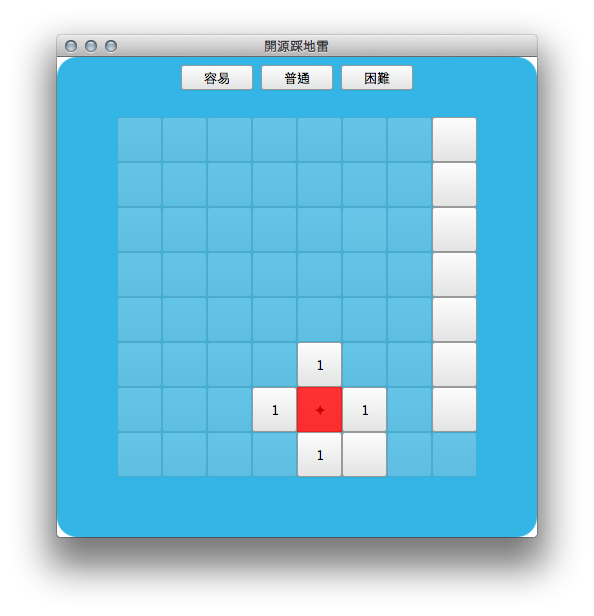

tutorial-workshop-clock
=======================

這是[臺灣大學開源社](https://ntuosc.org) [2015 人文青年暑期工作坊](ntuosc.kktix.cc/events/humanities-workshop)課程中逐步演練實作的範例程式。

於 Qt 5.5.0 環境底下編譯，以 [MIT License] 釋出供公眾利用。
